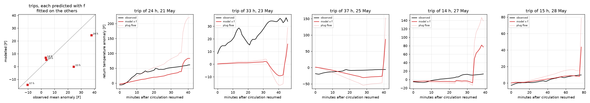
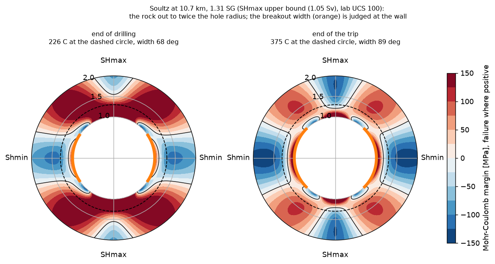
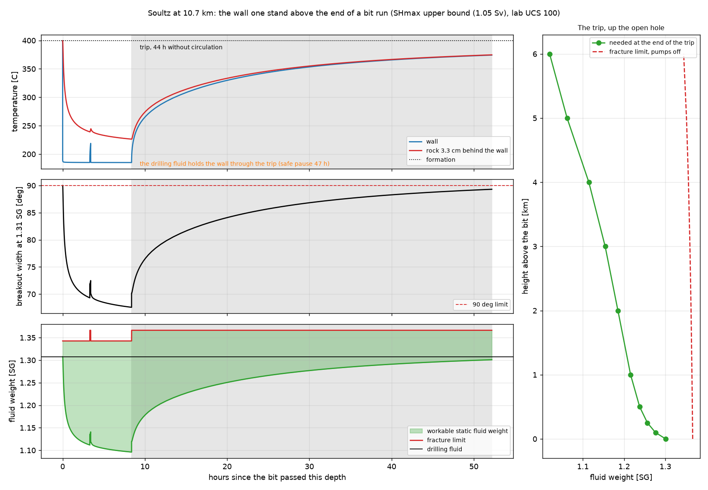

# Quenchwell: models of circulating temperature and borehole stability for drilling into superhot rock

Quenchwell is an open-source tool, written in Python, for screening sites for drilling into rock at around 400 °C. For a given site it takes the temperature profile, in-situ stresses, rock strength and well design, and selects the drill pipe and flow rate that keep the drilling tools below their temperature limit and carry the rock cuttings out of the hole. It then calculates the temperature and thermal stress of the borehole wall and the range of drilling-fluid weights that keeps the wall stable, and reports a verdict together with the basis for that verdict. The tool is applied here to five candidate sites.

The circulation model has been validated against temperatures measured in the insulated drill pipe trial in Utah FORGE well 16B. The model of the borehole wall reheating when circulation stops rests on analytic solutions; a comparison with the return temperatures after five trips in the same well is too coarse to confirm or reject it. The stability model has been calibrated against breakouts in the UD-1 well at United Downs, Cornwall, and checked against wells at Soultz-sous-Forêts and Newberry.

At Soultz and United Downs, where stress and rock strength have been measured or calibrated, a superhot borehole appears drillable with a commercially available insulated drill pipe and a weighted drilling fluid: 1.31 SG at Soultz and 1.26 SG at United Downs, within 0.03 SG of the weights at which the rock would fracture while circulating (1.34 and 1.29 SG). At that weight the hole holds through a trip to change the bit at Soultz. At United Downs the fluid must be raised to 1.27 SG before a trip, which is below the fracture limit of 1.32 SG with the pumps off.

The wall is held by the weight of the fluid. When the bit exposes the rock, the rock a few centimetres behind the wall, into which a breakout grows, is still at formation temperature, and breakouts have been imaged at the bit within minutes of drilling (Moore et al., 2011). Cooling the wall therefore does not lighten the drilling fluid. The insulated pipe keeps the drilling tools below their temperature limit, and the cooling it provides slows the creep of the hot rock into the hole.

The targets at both sites lie 6 to 11 km below the deepest stress measurements, so the results are projections from much shallower data.

The name is taken from Quenchwell, a hamlet in Feock, Cornwall, a few miles from United Downs.

## 1. Introduction

Rock at temperatures of around 400 °C, often called superhot rock, could yield considerably more power per well than conventional geothermal systems, because water at those conditions is supercritical and carries much more energy. Reaching it is primarily a drilling problem. Electronics and seals in the bottom-hole assembly fail above roughly 200 °C, hot crystalline rock is slow to cut, and a hot, highly stressed borehole wall may break out or creep shut. The deepest borehole yet drilled, the Kola superdeep well, reached 12.3 km, where the rock proved hotter and more plastic than expected; in most continental crust, 400 °C lies deeper still. Where it is shallower, as at Larderello in Italy, the Venelle-2 well recorded temperatures of 507 to 517 °C at 2.9 km depth (Bertani et al., 2018).

The concept examined here relies on a single circulating loop to address all three problems. Cold fluid is pumped down an insulated pipe within the drill string to the bit, where it keeps the tools below their survival limit and quenches the rock face. The quench may crack the rock directly (thermal spallation) or weaken it so that the bit cuts faster, and it cools the borehole wall, which slows the creep of hot rock into the hole. The fluid then returns up the annulus in contact with the hot rock and brings heat back to surface while the well is being drilled. As a production system, a single closed loop is limited by conduction through the rock to a few megawatts of heat, as Model 1 shows below and as the closed-loop field results and studies cited in Section 2 find. The fivefold to tenfold advantage per well claimed for superhot rock assumes open-loop flow through fractured rock (Clean Air Task Force, 2022), which is how Mazama Energy plans to develop Newberry. The models here are therefore concerned with the loop as a means of drilling the well, and the heat it returns is treated as a by-product.

The models were built to test each part of this concept from first principles, using IAPWS-95 water properties and rock and stress parameters taken from the literature. They are one-dimensional or axisymmetric, and steady-state apart from the model of the borehole wall through the drilling cycle. The circulation model (Model 1) has been validated against field measurements to within a few degrees (Section 3.1). The models of spallation, drilling rate and creep (Models 2 to 4) rest on parameters taken from the literature and remain order-of-magnitude estimates. Their purpose is to identify the constraints that govern feasibility and to quantify the trade-offs between them. A full reservoir or geomechanical simulation would still be needed to design a well.

## 2. Related work

The use of insulated drill pipe to keep the bit cool in hot rock is well established. Sandia National Laboratories and Drill Cool Systems built insulated drill pipe in the 1990s and tested it in the laboratory and in a geothermal well, comparing circulating temperatures with those in conventional pipe (Finger et al., 2000). A later DOE-funded project to develop it for high-temperature drilling stopped after its first phase, because a pipe strong enough for the hole left too small a bore for the flow (Champness et al., 2008). Eavor ran internally and externally coated pipe at Utah FORGE in 2023 and has published its field experience and coating properties (Vetsak et al., 2024). Circulating temperatures in wells have been calculated analytically since Raymond (1969), Holmes and Swift (1970) and Kabir et al. (1996), and numerically with Sandia's GEOTEMP (Mitchell, 1981) and GEOTEMP2 (Mitchell et al., 1984), which Ujyo et al. (2026) have extended to supercritical water as GEOTEMPSC; they find that circulation cools the rock only a few metres from the wall. Model 1 is a steady-state model of the same kind. The recovery of the temperature around a borehole after circulation stops has been treated with line-source solutions since Bullard (1947) and Lachenbruch and Brewer (1959). Wu et al. (2025) compared conventional, coated and dual-wall pipe in deep vertical and horizontal wells with a transient thermo-hydraulic model, and Pearce and Pink (2024, 2025) concluded that superhot wells can be drilled by combining existing technologies, with insulated pipe the main means of keeping tools below their 175 to 200 °C limits.

The mechanics of borehole stability used here are also established. The stress concentration around a borehole, breakout formation under a Mohr-Coulomb criterion and the use of breakout width to infer stress are standard (Zoback, 2007). Cooling a borehole wall adds a thermal hoop stress that suppresses breakouts and promotes tensile fractures, the combination studied by Hals and Berre (2012). In practice, the Japan Beyond-Brittle Project describes drilling at Kakkonda into rock above 500 °C with continuous circulation, and sets a target of cooling the hole below 160 °C (Muraoka et al., 2014), and Kruszewski and Wittig (2018) reviewed the failures in 20 wells drilled into supercritical conditions, many of them in casing and cement under thermal load. On the production side, Eavor's Geretsried project now reports about 8.5 MW of heat from its first loop, more than 2 MW per lateral pair falling to an expected 1.3 MW after five years (Eavor, 2026), and Beckers and Johnston (2022) estimated about 22 MW of heat and 2.2 MW of electricity from a 7.5 km loop with more than 90 km of laterals at 30 °C/km.

The contribution of this repository is to link these elements for named sites in a single open tool, whose results are fixed by its test suite. The circulating temperature from a validated model is carried through to the thermal stress at the wall, to the range of drilling-fluid weights that keeps the wall stable through the drilling cycle, and to the depth of the target below the site's data. The stability model has been calibrated in one well and checked in two others, and the circulation model has been compared with a published simulator and validated against field measurements.

## 3. Drilling with a single loop

The thermal balance of the loop (Model 1, `model1_coupled.py`) is solved for the fluid flowing down the drill string and back up the annulus. The well is represented by its casing and cement, a string of drill pipe, heavy-weight pipe and collars, and a pipe wall made up of its steel and insulation layers. The model includes the heat generated by friction in the pipe, annulus and bit nozzles, and the time for which each depth of the wall has been exposed to circulation. For rock at 450 °C at 12.4 km depth, at the 30 kg/s needed to lift the cuttings in an 8.67-inch hole, fluid reaches the bit at 390 °C with conventional pipe, 222 °C with pipe internally coated with NOV's TK-Drakōn, and 56 °C with the dual-wall pipe of Xiao et al. (2022) (Fig. 1). Tool survival depends above all on the insulation of the downgoing pipe. Water in the loop remains dense and supercritical below about 2 km, with no flashing. The heat returned is limited by conduction through the surrounding rock, to a few megawatts per loop once the rock has been circulated against for a year (Fig. 1); the higher figures in the site table are for rock freshly exposed while drilling. Because that conduction depends only logarithmically on the borehole radius, a tenfold increase in diameter yields only about 1.9 times the heat, and output scales instead with the length of hole in contact with hot rock.


*Fig. 1. Temperature of the downgoing fluid, the returning fluid and the rock along a 12.4 km well to 450 °C rock (Model 1), at 30 kg/s, for conventional pipe, TK-Drakōn coated pipe and dual-wall pipe, with the rock exposed for a year. At this flow the TK-Drakōn case is above the 200 °C tool limit; a higher flow brings it below.*

### 3.1 Checking the circulation model

Model 1 was first compared with the transient simulator of Wu et al. (2025), with their published well, string, fluid and flow and nothing fitted (`benchmark_utaustin.py`). The comparison identified one omission in Model 1, the heat generated by friction. Their dual-wall pipe loses about 70 MPa to friction, which warms the mud by about 18 °C; with this heat included, Model 1 agrees with their results for conventional and dual-wall pipe to within 7 °C in the vertical well and 2 °C in the horizontal well. The results for coated pipe do not agree. With the 1 mm coatings described in their text, Model 1 is 30 to 60 °C hotter than their results, and with the single conductivity per pipe given in their table applied across the whole wall, it is 10 to 36 °C colder. Their results lie between the two, and the paper does not state which interpretation their model uses. The standpipe pressures from Model 1 are 10 to 25% higher than theirs, of which 1.4 MPa is the loss across a bit whose nozzles they do not specify.

| Base case, 600 gal/min, 24 °C/km | Wu et al. | Model 1 | Model 1, whole-wall reading |
|---|---|---|---|
| Vertical, conventional | 179 °C | 172 °C | 172 °C |
| Vertical, internally coated | 76 °C | 126 °C | 66 °C |
| Vertical, externally coated | 121 °C | 153 °C | 91 °C |
| Vertical, dual-wall | 59 °C | 61 °C | 61 °C |
| Horizontal, conventional | 206 °C | 207 °C | 207 °C |
| Horizontal, dual-wall | 65 °C | 67 °C | 66 °C |

The field comparison uses the trial of Eavor's insulated drill pipe in Utah FORGE well 16B in May 2023 (`validate_forge16b.py`). Four bits were run in 9.5-inch hole at 60 to 70° inclination: two on regular pipe, one on a full string of insulated pipe and one with about 70% insulated pipe above regular pipe. The well's survey, casing, string, rock properties and drilling record come from the public FORGE dataset, the flow and inlet temperature minute by minute from the rig's records, and the measured MWD temperatures from Eavor's trial report. The model is run at half-hourly intervals while each bit was drilling and compared with the fluid temperature in the pipe at the MWD sensor. Without fitting, the model overestimated the temperature on the runs with regular pipe by 4 to 12 °F. A multiplier of 0.75 on the annulus heat-transfer coefficient, fitted to those runs, brings them within 5 °F. One effective conductivity for Eavor's pipe, fitted on the full insulated run, gives 4.9 W/m·K across the pipe wall, which is within about 15% of the wall resistance of a 1 mm coating at 0.47 W/m·K on steel, the coating Eavor has described (Vetsak et al., 2024). The run with partial insulation was then predicted with no further fitting.

| Run | Measured MWD | Fitted model | Model with the film unfitted |
|---|---|---|---|
| BHA 10, regular pipe | 180 °F | 184 °F | 192 °F |
| BHA 11, insulated pipe (fitted) | 149 °F | 149 °F | 149 °F |
| BHA 12, partial, blind | 164 °F | 157 °F | 160 °F |
| BHA 12 after levelling, blind | 150 to 160 °F | 159 °F | 161 °F |
| BHA 13, regular pipe | 220 °F | 218 °F | 228 °F |

Eavor estimated from the data how each change between the first two runs moved the MWD temperature. Rebuilt one factor at a time, the model attributes −9 °F to the higher flow (Eavor −12 to −14), +17 °F to the warmer inlet (+23), +9 °F to the added depth (+7) and −61 °F to the insulated pipe. Eavor's breakdown gives −47 to −49 °F for the pipe, which they describe as conservative, and their overall estimate of its benefit, against the runs before and after, is 47 to 75 °F. The site evaluations use the unfitted coefficient, since the multiplier absorbs all the effects the model omits at FORGE and there is no evidence that it applies to a 12 km well; it is reported as a sensitivity. With the coefficient unfitted, BHA 12 is predicted to within 4 to 6 °F, and the temperatures on the runs with regular pipe are overestimated, so the model errs towards a warmer wall and therefore towards caution.


*Fig. 2. Left: modelled MWD temperature while drilling each run (points), against the measured run averages (bars) and BHA 12's levelled range (shaded). Right: the change between the first two runs, one factor at a time, from the model and from Eavor's estimate.*

The reheating of the wall when circulation stops is calculated with a transient model of conduction in the rock around the hole, described in Section 4.1. It was compared with the return temperature recorded in FORGE 16B when circulation resumed after each of the five trips in the trial (`validate_forge_pauses.py`). While the pumps are off, the fluid in the hole drifts towards the temperature of the rock around it, warming in the deep part of the hole and cooling near surface, and when they restart the annulus column reaches surface over the first bottoms-up, shallowest fluid first. In the model, the rock at points every 200 ft along the hole is taken through its own history of circulation and pauses from the rig's minute-by-minute record, and the column of fluid temperatures is pushed to surface as plug flow. Plug flow ignores the heat the returning fluid exchanges with the string and the rock on its way up, so one factor scales the modelled anomaly in the return temperature. Fitted on four of the five trips and used to predict the fifth, in turn, the factor is 0.55, and the predicted mean anomalies differ from the observed ones by 13 °F (root mean square), against observed anomalies of −10 to +38 °F (Fig. 3). The largest miss is the 33-hour trip, observed at +25 °F and predicted at 0 °F. With the fluid in the hole taken at the wall's temperature, the sensitivity used for the sites, the factor is 0.36 and the misfit 16 °F. The pauses with the bit on bottom could not be used, as most were for gyroscopic surveys or circulation at reduced flow, and their first bottoms-up runs into the next operation. The modelled curves are dominated by the arrival of the hot fluid from the bottom of the hole, which the observed curves do not show, and the fit barely separates the base case from the case with no fluid in the hole. The comparison is therefore too coarse to confirm or reject the reheating model, which rests on its analytic checks (Section 4.1). It is nonetheless the only field record of reheating found in the public data.



*Fig. 3. Return temperature anomaly over the first bottoms-up after each trip in FORGE 16B: observed (black), from the plug-flow column (dotted) and scaled by the factor fitted on the other trips (red). Left: the mean anomaly over each bottoms-up, predicted against observed.*

### 3.2 Drilling rate, creep and the brittle-ductile transition

The quench was expected to make superhot drilling much faster, but this expectation is only partly borne out. Thermal spallation (Model 2, `model2_spallation.py`) requires the thermal tension at the quenched face to exceed both the rock's tensile strength and the confining stress, which grows with depth. It is therefore possible only in crust where the horizontal stress is low relative to the vertical (a ratio K0 below about 0.5, typical of extensional settings) and the rock is still brittle (Fig. 4). Where spallation occurs, the coupled drilling model (Model 3, `model3_optimiser.py`) predicts rates of penetration up to about 7.5 times those without the quench. Elsewhere the quench lowers the energy needed to cut the rock without breaking it outright, and the gain is 1.5 to 2.3 times (Fig. 5). Similar quench-assisted fracture has been reported by Holtzman et al. (2023) and in the literature on cryogenic and thermal-shock stimulation of enhanced geothermal systems.


*Fig. 4. Thermal tension available from the quench (red) against the tension needed to crack the rock at each stress ratio K0 (dashed). Spallation is possible in the shaded window, at low K0 and below the brittle-ductile transition.*


*Fig. 5. Gain in rate of penetration from the quench across target temperature and stress ratio K0. The 7.5× band is pure spallation; elsewhere the gain is 1.5 to 2.3×.*

Cooling also slows the closure of the hole by creep. Hot rock creeps slowly into an open borehole, and the hotter the rock, the faster it creeps. Model 4 (`model4_hole_stability.py`) shows that cooling the wall to 200 °C slows this creep by a factor of 10^5 to 10^6, and that convection carries too little heat back into the cooled rock to undo the effect. Where the wall does break out, Model 5 (`model5_convergence_confinement.py`) shows that the damaged zone is only millimetres deep and is held in place by the fluid pressure, well short of collapse.

The approach meets a further limit at about 400 °C, where granite stops fracturing and begins to flow: the brittle-ductile transition, reached at depths between about 5.5 and 19 km depending on the geothermal gradient. Cooling does not remove this limit for spallation. At the bit, the quench chills only a skin a few millimetres thick before it is cut away, while the rock that would have to crack lies behind it at full temperature and yields by flowing. Above about 400 °C, the quench can therefore only weaken the face, as it does in most rock. Cooling does still slow the closure of the hole by creep, because the cooled shell around the wall, about 1.5 m thick after a week, keeps the hot rock away from the stress concentration at the wall (Model 4). The 400 °C targets used here sit at the transition; whether the approach can be pushed hotter rests on that creep argument, which has not been tested in practice.

## 4. Borehole stability

The site verdicts depend mainly on whether the borehole wall can be kept stable. Drilling a vertical hole concentrates the in-situ stresses around its circumference, and where the resulting hoop stress exceeds the strength of the rock, the wall spalls in two lobes on opposite sides of the hole, in the direction of the minimum horizontal stress (Shmin). These features are known as breakouts. Wells are routinely drilled with breakouts present; problems arise when the breakouts become too wide. Following the empirical criterion of Zoback (2007), a site is rated GO if breakouts stay within 90° of the circumference with drilling fluid at hydrostatic weight. It is rated CONDITIONAL if a heavier fluid brings them within 90° while its pressure stays below Shmin; above Shmin the fluid would fracture the rock and be lost into it. It is rated NO-GO if any fluid heavy enough to hold breakouts within 90° would also exceed Shmin. The equations are given in the Appendix.

### 4.1 The wall and the rock behind it

The temperature of the rock around the hole through the drilling cycle is calculated by implicit finite volumes for radial conduction (`wall_thermal.py`). While the fluid circulates, the wall exchanges heat with the annulus at the temperature and film coefficient that Model 1 gives. When circulation stops, the fluid in the hole is treated as a single well-mixed volume coupled to the wall by the laminar film coefficient (a Nusselt number of 4.36), the conservative floor Model 1 already uses, so that the fluid slows the reheating; the case with no fluid, in which the wall reheats faster, is a sensitivity. Jaeger (1956) gave the corresponding solution for a cylinder containing a perfect conductor. The solver reproduces the heat flow from a cylinder held at constant temperature (Carslaw and Jaeger, 1959) to within 1.2% and the recovery after a period of constant heat flow to within 2%, both evaluated by numerical inversion of the Laplace-transform solutions (Abate and Valkó, 2004). The line-source approximation (Bullard, 1947) differs from the cylinder solution by 6 to 13% over the times of interest and is reported for comparison only.

The thermal stresses in the rock follow from the temperature field for plane strain with a free wall (Timoshenko and Goodier, 1970). They are added to the full Kirsch solution with the wellbore pressure (Jaeger et al., 2007), and the Mohr-Coulomb criterion is applied at each radius and angle with the strength at the local temperature (`model5_convergence_confinement.py`). In an elastic Mohr-Coulomb analysis the failed region reaches wider just behind the wall than at the wall itself, at the edges of the breakout, so the angular extent of failure in the rock is not a measure of breakout width (Fig. 6). The width is therefore judged at the wall, as an image log measures it and as the 90° criterion and the UD-1 calibration assume, but with the temperature of the rock at the depth to which the breakout would reach in uncooled rock, about 3 cm at Soultz. A cooled zone thicker than that keeps its benefit, and a thin or reheated one is judged by the warmer rock behind it. With no cooling the result is the width at the wall.

Breakouts begin as the bit exposes the rock. Moore et al. (2011) compared images logged at the bit, minutes after drilling, with images taken 30 minutes to 3 days later in four boreholes of the NanTroSEIZE transect, in sediment, and found breakouts already present at the bit and widening with time in all four. The width check is therefore applied from the moment of exposure (Section 5). In the first minutes of cooling, the contracting skin pushes hoop stress into the rock just behind it, and the failed depth from the full stress field at Soultz grows from 1.9 cm in uncooled rock to 2.1 cm after a minute, falling below the uncooled depth within 5 minutes. Over that time the width check uses rock within a few kelvin of formation temperature, so the effect does not conceal a worse case.



*Fig. 6. Mohr-Coulomb margin in the rock out to twice the hole radius at Soultz at 10.7 km and 1.31 SG, at the end of drilling (left) and at the end of a 44-hour trip (right), in the case of stress and strength that decides the site's verdict. Failure is where the margin is positive (red, bounded by the black contour). The dashed circle is the depth the uncooled breakout reaches, whose temperature sets the width at the wall (orange). The failed regions behind intact wall, at about 45° to the stress directions, arise from the elastic criterion; at the wall in the direction of SHmax the margin is positive where the hoop stress is tensile.*

### 4.2 Calibration against UD-1

UD-1 was drilled into the Carnmenellis granite with drilling fluid below 1.05 SG (specific gravity relative to water) in its 12.25-inch section, and stress magnitudes at the site have been published by Reinecker et al. (2021). The British Geological Survey's interpretation of the UD-1 borehole images (BGS, 2024) records 24 breakouts in the near-vertical part of the well between 900 and 4,000 m measured depth, each with its depth and angular width. Given the stresses, the width of a breakout fixes the strength of the rock in which it formed, so the rock strength can be fitted directly (`calibrate_ud1.py`). The intervals that did not break out set a lower bound on the strength of intact rock.

The temperature of the drilling fluid at the wall was not published, and its cooling effect was therefore bracketed between 0 and 40 K. Over that range the median strength of the rock that broke out is 118 to 147 MPa, and intact rock must have a strength of at least 172 to 203 MPa. With these values the model predicts breakouts from about 2.9 km depth, compared with one logged at 2.2 km and the rest from 3.1 km (measured depth, which differs from vertical depth by less than 10 m in this section), and widths of 53 to 57° near the base of the section, compared with 50 to 53° logged (Fig. 7). The 51 breakouts recorded in the deeper, deviated part of the well were not used in the fit; they fall between the predictions for weak and intact rock. The interpretation summarised by Reinecker et al. (2021) contains more breakouts over the same interval (27, totalling 139 m against 46 m), and the calibration is accordingly specific to the BGS reading of the images.

The calibration was repeated with the cooling credited only as deep as the breakout reaches. Each depth was taken as circulated against from the time the bit passed it, at a rate of penetration of 3.6 m/h (2.0 to 5.2 m/h as a sensitivity, from the drilling times in Reinecker et al., 2021). The weak-zone strength becomes 119 to 147 MPa, and the intact bound is unchanged, because the cooled zone at UD-1 extends further into the rock than its breakouts.


*Fig. 7. Left: breakout widths logged in UD-1 (filled, 12.25-inch section; hollow, deviated 8.5-inch section) and widths predicted for weak-zone and intact rock. Right: rock strength implied by each breakout over the 0 to 40 K range of wall cooling.*

### 4.3 Cross-check at Soultz-sous-Forêts

The Soultz wells GPK3 and GPK4 reached 5 km with breakouts, and their stress state has been characterised to that depth by Valley and Evans (2007). With nothing fitted to Soultz (`crosscheck_soultz.py`), the model predicts breakouts at 5 km with a drillable range of fluid weights in 46 of 48 combinations of rock strength, wall cooling and stress. Using the weak-zone strengths from UD-1 without adjustment, it places the first breakouts at 2.6 to 3.8 km depth; in GPK4 they appear at about 3.0 km and become dense below 3.7 km. With the laboratory strength of Soultz granite (100 to 130 MPa) and the lower bound on the maximum horizontal stress, the onset falls at 3.64 km, consistent with the analysis of Valley and Evans (2007). That a strength calibrated in one granite reproduces the failure pattern in another is encouraging, although two wells are a small basis for generalisation. Judged with the temperature of the rock behind the wall, after 1 or 24 hours of circulation at 40 K below formation temperature, the widths at 5 km increase by up to 3°, and the window of fluid weights stays open in every case.

### 4.4 Cross-check at Newberry

NWG 55-29 at Newberry, Oregon, was imaged with a borehole televiewer in 2008 during a programme of injecting cold water to cool the well, at up to 277 °C. Davatzes and Hickman (2011) found breakouts throughout the volcanic rocks above about 8,610 ft and none in the granodiorite below, and derived the stresses from them with a strength taken from the neutron porosity log. They set the thermal stress of the cooled wall to zero. With their stresses and porosity-derived strength, the well's logs from the Geothermal Data Repository (Cladouhos, 2012) and nothing fitted (`crosscheck_newberry.py`), the model matches the volcanics' modal breakout width of 36° when the wall is 25 to 35 K below its static temperature. This is the same order as the 20 K of cooling implied by the log's maximum temperature against the static temperature at its base, and it is the first test of the thermal term at about 290 °C. With the cooling credited only as deep as the breakout reaches, the width in the volcanics is matched at 25 to 40 K. The model also predicts breakouts over most of the logged granodiorite, where none were seen, as does the authors' own criterion. The porosity relation gives the granodiorite 60 to 82 MPa against 51 to 74 MPa in the volcanics, too little contrast to separate them, so the pattern by rock type is not reproduced. Their friction coefficient (0.55, with 0.70 as an alternative) is used for this well and for the site, because their stresses were derived with it; it differs from the 0.8 used at United Downs. The Shmin they quote at 8,420 ft corresponds to their formula at 0.70, and both cases are run.

## 5. Site assessment

The five sites were assessed for a target rock temperature of 400 °C (`comparative_sites.py`). They are not equally well characterised, and the results are reported in two groups accordingly. At Soultz and United Downs the stress magnitudes and rock strength have been measured or calibrated at the site, and the stability model has been checked against wells drilled there. At Larderello and in the Pannonian Basin, no stress magnitudes or rock strengths were found in the literature; the stresses are bounded only by the type of faulting observed (Liotta and Brogi, manuscript; Bada et al., 2007), and the strengths have no source. Newberry has stresses from a breakout analysis and strengths derived from logs, but its well check did not reproduce the breakout pattern, so it is grouped with them. Mazama Energy is developing Newberry as an open-loop enhanced geothermal system, and the table assesses drilling there; production is outside its scope. For the Pannonian Basin the table covers the transtensional part of the strike-slip regime described for the basin interior, with the maximum horizontal stress close to the vertical.

In the model, each site is drilled to the well design of Wu et al. (2025), with casing to 4 km and 8.67-inch open hole below, and water as the circulating fluid. The drill pipe is the best-insulated pipe that is commercially available, which is pipe internally coated with NOV's TK-Drakōn. The flow is the larger of the lowest flow that keeps the bit below 200 °C and the lowest that lifts the rock cuttings to surface (hole cleaning), taken as the annular velocity at which FORGE 16B was drilled, provided that the standpipe pressure remains below 51.7 MPa. At the three deep sites the flow is set by the tool limit, at 35 to 50 kg/s, which places the circulating temperature at the bit at 184 to 188 °C; at Larderello and Newberry it is set by hole cleaning, at 30 kg/s.

Over the drilling cycle (`site_evaluation.py`, `drilling_cycle.py`), the wall is followed through a bit run and the trip that ends it. The timings are taken from the FORGE 16B record. From the 10-second record over the whole well, connections stop the pumps for 2.8 minutes at the median and 6.3 minutes at the 90th percentile, and the fluid circulates for 1 minute at the median, and 20 seconds at the 10th percentile, between the last new hole and the pumps stopping. From the trial week, trips run at 1,694 ft/h out and 1,833 ft/h in, with 3.9 hours at surface for a routine change of bit and bottom-hole assembly; scaled to the sites' depths, a trip takes the bottom of the hole out of circulation for 40 to 52 hours. Each case of stress and strength is checked in four states. Drilling is checked at circulating pressure as the bit exposes the rock. A connection is checked at static pressure on the rock just drilled, after 20 seconds of circulation and a 6.3-minute pause, and again one stand above the end of the run, the part of the open hole circulated against least before the trip. The trip is checked at static pressure at its end. The drilling fluid is the lightest that holds the wall in the first three states, and it must stay below the fracture limit while circulating. The safe pause is the time after drilling stops for which the wall holds at that weight with the pumps off, and the trip fluid is the weight the wall needs at the end of the trip, against the fracture limit at static pressure. The site's verdict is that of its worst case.

| Site | Depth to 400 °C | Verdict | Drilling fluid | Limit while circulating | Safe pause | Trip | Trip fluid | Limit, pumps off |
|------|-----------------|---------|----------------|-------------------------|------------|------|------------|------------------|
| Soultz-sous-Forêts (FR) | 10.7 km | CONDITIONAL | 1.31 SG | 1.34 SG | 47 h | 44 h | 1.30 SG | 1.37 SG |
| United Downs (UK) | 12.9 km | CONDITIONAL | 1.26 SG | 1.29 SG | 35 h | 52 h | 1.27 SG | 1.32 SG |
| Larderello (IT) | 2.4 km | GO | water | 1.32 SG | more than a week | 13 h | water | 1.33 SG |
| Pannonian Basin (HU) | 9.7 km | CONDITIONAL | 1.42 SG | 2.48 SG | 77 h | 40 h | 1.39 SG | 2.50 SG |
| Newberry (US) | 3.6 km | GO | water | 1.34 SG | more than a week | 17 h | water | 1.36 SG |

At both well-characterised sites the wall is held by the weight of the drilling fluid, and the window is narrow (Fig. 8). Soultz needs 1.31 SG against a limit of 1.34 SG while circulating, and United Downs 1.26 SG against 1.29 SG; both limits already include the 0.05 SG margin below Shmin. The drilling fluid is set by the rock the bit has just exposed. The wall itself is cooled within seconds, but the rock a few centimetres behind it, the depth to which the breakout would grow, is still near formation temperature during the first minutes, when the bit drills on and the pumps stop for the next connection. The cooling provided by the insulated pipe therefore does not lighten the fluid needed at the bit. At Soultz the drilling fluid holds the wall for 47 hours without circulation, longer than a trip. At United Downs it holds for 35 hours, and the fluid must be raised to 1.27 SG before a 52-hour trip. Higher in the open hole the rock is cooler, and the fluid needed at the end of a trip falls from 1.30 SG at the bottom to 1.06 SG 5 km above it at Soultz (Fig. 8, right).

If breakouts took an hour to form, the rock at the breakout's depth would be cooled before it is judged, and the drilling fluid would fall to 1.17 SG at Soultz and 1.14 SG at United Downs; the observations of Moore et al. (2011) do not support such an allowance for the start of failure. With FORGE's median circulation before a connection in place of its 10th percentile, United Downs needs 1.25 SG and Soultz is unchanged. At the highest flow within the pump limit, 90 kg/s, both sites become NO-GO in their worst case: the added circulating friction lowers the limit while circulating below the weight the freshly drilled rock needs through a connection, at static pressure. A higher flow therefore narrows the window over the cycle. The dual-wall pipe lengthens the safe pause to 115 to 135 hours without lightening the drilling fluid. Halving or doubling the trip time moves the trip fluid by about 0.02 SG, and without the fluid in the hole slowing the reheating, United Downs needs 1.27 SG to drill. Staged circulation on the way back in and a longer bit run leave the bottom of the hole unchanged. With UD-1's stricter 63° limit in place of 90°, both sites are NO-GO, since the wall at the bit is effectively uncooled and both would need more than 1.5 SG to drill. The 63° limit is probably conservative, since UD-1 was drilled to its target through breakouts of 35 to 90° in its deviated lower section; the widths there are not directly comparable with a vertical hole, but they are consistent with the 90° criterion. At Larderello and Newberry the wall holds with water for more than a week without circulation.



*Fig. 8. The wall at Soultz at 10.7 km, one stand above the end of a bit run, in the case of stress and strength that decides the site's verdict, through about 8 hours of drilling with one connection and a 44-hour trip (shaded), and the fluid needed at the end of the trip up the open hole (right). Top: temperature of the wall and of the rock 3.3 cm behind it, the depth the uncooled breakout reaches. Middle: breakout width at the drilling fluid weight of 1.31 SG. Bottom: the static fluid weights that hold breakouts within 90° (green), below the fracture limit (red), with the circulating friction credited while drilling. The window is narrowest as the bit exposes the rock.*


An earlier assessment checked the wall only while circulating, with the wall at the circulating temperature at the bit and the rock freshly exposed at the rate of penetration from Model 3. The lower bound of the fluid-weight window was checked at static fluid weight and the upper bound at the circulating pressure, which adds the annular friction loss of 0.02 to 0.04 SG. Its results are kept for comparison:

| Site | Depth to 400 °C | Pipe and flow | Wall | Stability | Flow for GO | Heat returned while drilling | Basis |
|------|-----------------|---------------|------|-----------|-------------|-----------------|-------|
| Soultz-sous-Forêts (FR) | 10.7 km | TK-Drakōn, 40 kg/s | 184 °C | CONDITIONAL: GO in 6 of 9 cases; worst case needs 1.07 SG | 60 kg/s (956 gal/min) | 5.5 MW | measured stress to 5 km; laboratory strength; checked against GPK3/GPK4 |
| United Downs (UK) | 12.9 km | TK-Drakōn, 50 kg/s | 188 °C | CONDITIONAL: GO in 2 of 4 cases; worst case needs 1.07 SG | 80 kg/s (1,275 gal/min) | 6.7 MW | measured stress (Shmin to 2 km); strength calibrated on UD-1 |
| Larderello (IT) | 2.4 km | TK-Drakōn, 30 kg/s | 71 °C | GO | | 2.5 MW | stress regime only; strength unsourced; temperature measured in Venelle-2 |
| Pannonian Basin (HU) | 9.7 km | TK-Drakōn, 35 kg/s | 188 °C | CONDITIONAL: GO in 3 of 5 cases; worst case needs 1.06 SG | 70 kg/s (1,116 gal/min) | 4.5 MW | stress regime only; strength unsourced; no deep wells |
| Newberry (US) | 3.6 km | TK-Drakōn, 30 kg/s | 90 °C | GO | | 2.8 MW | stress from breakouts; strength from logs; well check not reproduced |

Where the data give a range of values (the measured range of maximum horizontal stress at Soultz, the four calibrated strengths at United Downs, the regime bounds and friction coefficients elsewhere), every combination was evaluated, and the tables report the worst case. In this assessment the window at both well-characterised sites was open at close to the weight of water because of the cooling: with the wall at rock temperature, Soultz needed at least 1.33 SG against a fracture limit of 1.34 while circulating. The flow for GO is the lowest flow at which the same pipe gives GO in every case while circulating, within the pump limit. All three exceed the 600 to 700 gal/min at which FORGE 16B was drilled, but they are within what three pumps of the rating of NOV's 14-P-220 triplex pump deliver at the standpipe pressures required (NOV, 2014); FORGE's rig had at least three pumps. Over the drilling cycle these flows do not give GO. With the dual-wall pipe of Xiao et al. (2022) the wall is cooled to 48 to 64 °C and every site is GO at 30 kg/s while circulating, and the same holds with vacuum-insulated tubing; neither has been made as drill pipe. The heat figures are early-life values for a single loop at the flow used.


*Fig. 9. Left: range of breakout widths at hydrostatic fluid weight across each site's cases, against depth to 400 °C; filled markers show the well-characterised sites. Right: depth reached by each site's stress and temperature data, against its target.*

The most important qualification is the depth of extrapolation (Fig. 9). The stress data at Soultz extend to 5 km and those at United Downs to 2 km, so the 400 °C targets lie 5.7 and 10.9 km below the deepest measurement. At Newberry the target lies 1.0 km below the stress data and 0.6 km below the temperature data. Below the data, the stresses are assumed to continue along their measured trends, limited by the frictional strength of the crust. This is a reasonable assumption but an untested one, and it is the largest single uncertainty in the verdicts. The full evaluation of the Soultz site is shown in Fig. 10.


*Fig. 10. Evaluation of the Soultz site (`site_evaluation.py`): temperature along the loop for the pipe and flow behind the verdict, measured stress profiles (shaded where data exist), and a summary of tool survival, heat, drilling rate, creep, stability and the fluid weights through the drilling cycle.*

## 6. Limitations and further work

Beyond the extrapolation of stress with depth, several assumptions limit the results. The flows at which the deep sites become GO while circulating exceed the rate at which FORGE 16B was drilled, and the rig capacity they are compared with is that of three pumps of a single manufacturer's rating. Over the drilling cycle a higher flow narrows the window. The circulation model has been validated against a single well, FORGE 16B, in rock at about 220 °C, below the superhot range, and the conductivity fitted for Eavor's pipe combines the effects of the coating and the tool joints, as neither has been published separately. Water is assumed as the circulating fluid at every site; a drilling mud would raise the standpipe pressure and could rule out the dual-wall pipe, as it does in Wu et al. (2025). The hole-cleaning requirement is taken from the annular velocity in a single well, as no published minimum could be found. Temperatures below 5 km at Soultz and United Downs are extrapolated at gradients of 35 and 28 °C/km that have no published source.

The verdicts while circulating take the wall at the temperature of the circulating fluid at the bit, which gives the greatest possible cooling. That cooling is about 215 K with the commercial pipe at the flows used, and about 340 K with the dual-wall pipe, against 0 to 40 K in the UD-1 calibration and 25 to 40 K at Newberry. The verdicts over the drilling cycle judge the wall as the bit exposes it, consistent with breakouts imaged at the bit within minutes of drilling (Moore et al., 2011); an allowance of an hour for breakouts to form, which would let the cooling lighten the drilling fluid, is reported as a sensitivity that those data do not support. Breakouts also grow after they form, over 30 minutes to 3 days in sediment (Moore et al., 2011) and over more than a year in crystalline rock in the COSC-1 borehole (Wenning et al., 2017). That growth is not modelled, and the cooled rock behind the wall may slow it. The thermal stresses are drained and thermoelastic. The change in pore pressure as the rock cools and reheats, which can add to or offset them in rock of low permeability (Ghassemi et al., 2009), is not modelled, and nor are the surge and swab pressures as the string is run in and pulled out during a trip. The cycle timings come from a single well, FORGE 16B, drilled to 2.5 km in rock at about 220 °C, and bits may wear faster in superhot rock and so need more trips. The comparison of the reheating with FORGE 16B's trips is too coarse to confirm or reject it, so the reheating model rests on its analytic checks. The drilling-fluid windows at the two well-characterised sites are about 0.03 SG wide, which is small against the uncertainty in the stresses at the targets. UD-1's breakouts were calibrated over a bracket of 0 to 40 K of wall cooling; if they formed as the bit exposed the rock, the 0 K end, with the stronger weak-zone rock, is the consistent one, and the site evaluation, which uses the full bracket, errs towards caution. The rock strength at UD-1 was calibrated with the stress profile taken as given, so the two cannot be checked independently with the data available: any error in the stresses at 2 to 4 km is carried into the fitted strength, and nothing ensures the error is the same at 12.9 km. The rock strength at Soultz comes from laboratory tests, which generally overestimate the strength of rock in place, and at Newberry from a porosity relation that does not distinguish the rock in which breakouts formed from the rock in which they did not. Pore pressure is taken as hydrostatic where it has not been reported, although the deep Pannonian Basin is reported to be overpressured. The stability check assumes a vertical hole, and the drilling-fluid margin below Shmin (0.05 SG) is a typical engineering allowance, with no site-specific value behind it. The models do not cover drilling with total losses of circulation, in which no fluid returns up the annulus, or the behaviour of rock above the brittle-ductile transition beyond the creep model.

The model predicts drilling-induced tensile fractures at all depths in the calibration wells, whereas they were logged only over parts of each hole. This follows from setting the tensile strength of the wall to zero, which is appropriate for a naturally fractured, critically stressed rock mass but leaves the model unable to say where tensile fractures will occur. Two parameters in the drilling model, the reduction in cutting energy due to the quench and the high-temperature flow law of the rock, are taken from the literature and would need laboratory calibration. The long-term cooling of the rock around a producing well, which determines production economics, is deliberately left out, since the bit always meets fresh hot rock while drilling.

The most useful additional data would be downhole temperatures from a hot, deep well drilled with insulated pipe, measurements of how far the circulating fluid cools the wall, observations of breakouts forming and growing in hot crystalline rock, from images logged while drilling and repeated later, stress measurements below 5 km at either well-characterised site, the drilling-fluid temperatures recorded while UD-1 was drilled, and stress magnitudes and rock strengths at Larderello and in the Pannonian Basin. The sources for all site data are documented in `data/sites/stress_sources.md`, `data/ud1/`, `data/newberry/`, `data/forge16b/` and `data/materials.md`.

## 7. Reproducing the results

From the repository root:

```bash
pip install -r requirements.txt
python src/water_table.py         # one-time build of the IAPWS-95 property table (~2.5 min)
python src/site_evaluation.py     # full evaluation of the Soultz site
python src/comparative_sites.py   # all five sites
python src/calibrate_ud1.py       # UD-1 strength calibration and Fig. 7
python src/crosscheck_soultz.py   # Soultz cross-check
python src/crosscheck_newberry.py # Newberry cross-check
python src/benchmark_utaustin.py  # benchmark against Wu et al. (2025)
python src/validate_forge16b.py   # FORGE 16B validation and Fig. 2 (about 10 min)
python src/drilling_cycle.py      # drilling-cycle timings from FORGE 16B
python src/validate_forge_pauses.py  # check of the reheating against FORGE 16B's trips and Fig. 3 (about 5 min)
```

Each model file also runs on its own and prints its analysis, for example `python src/model1_coupled.py`. The scripts `src/*_figures.py` regenerate the remaining figures in `figures/`. The test suite is run with `pytest`, which takes a few seconds and doesn't need the property table, or `pytest -m slow` to include the full runs, which do (the table is built on first use if it isn't there). A set of reference results is held fixed by the tests, so that any change to the models shows up as a difference. The FORGE and Newberry extracts can be rebuilt from the public datasets with the scripts in their data folders.

```
data/forge16b/            FORGE 16B survey, temperatures, string, drilling record and trial results
data/newberry/            NWG 55-29 logs and notes on Davatzes and Hickman (2011)
data/benchmarks/          inputs and results of Wu et al. (2025)
data/ud1/                 UD-1 sources: notes on Reinecker et al. (2021), BGS image-log interpretation
data/sites/               stress, strength and temperature sources for every site
data/materials.md         pipe, coating and cement properties, and which pipe can be bought
figures/                  generated figures
tests/                    test suite; golden/ holds the fixed reference results
src/
  geo_constants.py        physical constants, each with its source
  water_props.py, water_table.py      IAPWS-95 water properties
  well_geometry.py        well, casing, string and named pipe types
  model1_coupled.py       thermal balance and hydraulics of the circulating loop
  model1_steadystate.py, model1_diameter_scaling.py, model1_depth_limits.py
  model2_spallation.py    quench fracture against the confining stress
  model3_optimiser.py     coupled drilling and thermal model
  model4_hole_stability.py            creep closure of the cooled hole
  model5_convergence_confinement.py   yielding, breakout at the wall and failure behind it
  wall_thermal.py         temperature of the rock around the hole through the drilling cycle
  drilling_cycle.py       drilling-cycle timings from FORGE 16B
  site_evaluation.py      site data, flow and pipe choice, stability verdict
  comparative_sites.py    the five sites
  calibrate_ud1.py        rock-strength calibration against UD-1
  crosscheck_soultz.py    cross-check against the Soultz wells
  crosscheck_newberry.py  cross-check against NWG 55-29
  benchmark_utaustin.py   benchmark against Wu et al. (2025)
  validate_forge16b.py    validation against the FORGE 16B trial
  validate_forge_pauses.py            check of the reheating against FORGE 16B's trips
  *_figures.py            figure scripts
```

## Data credits

The FORGE data are from the Geothermal Data Repository, used under CC-BY 4.0: Utah FORGE: Well 16B(78)-32 Drilling Data (McLennan et al., 2023, https://doi.org/10.15121/1998591) and Utah FORGE: Deep Wells Temperature Surveys as of September 2022 (Jones, 2022, https://doi.org/10.15121/1893533). The NWG 55-29 logs are from Newberry EGS Demonstration: Well 55-29 Stimulation Data (Cladouhos, AltaRock Energy, https://doi.org/10.15121/1357916), also CC-BY 4.0. The UD-1 image interpretation contains NERC materials ©NERC 2024. The extracts in `data/` are derived from these datasets, and the README in each folder lists the files and how to rebuild the extracts.

## Licence

The code is released under the MIT licence (`LICENSE`). The files in `data/` keep the licences of the datasets they come from, given above and in each folder's README.

## Appendix: equations

The equations are given in the notation used in the code.

The loop model (Model 1) solves coupled heat balances for the downgoing and returning fluid along measured depth z, with the rock at the temperature of its true vertical depth, and with the heat dissipated by friction (pressure gradient dp/dz) added to each stream:

$$\dot{m}c_p\frac{dT_d}{dz}=UA_i(T_u-T_d)+\frac{\dot{m}}{\rho}\left|\frac{dp}{dz}\right|_d$$

$$\dot{m}c_p\frac{dT_u}{dz}=UA_i(T_u-T_d)-UA_o\big(T_{\text{rock}}(z)-T_u\big)-\frac{\dot{m}}{\rho}\left|\frac{dp}{dz}\right|_u$$

$$T_d(0)=T_{\text{inj}},\qquad T_u(L)=T_d(L)+\frac{Q_{\text{face}}}{\dot{m}c_p}+\frac{\Delta p_{\text{bit}}}{\rho c_p}$$

The conductances per unit length are resistances in series: the films on each side, each layer of the pipe wall, and on the rock side any casing and cement and the conduction into the rock, which limits the heat per unit length:

$$\frac{1}{UA_i}=\frac{1}{2\pi r_b h_d}+\sum_j\frac{\ln(r_{j+1}/r_j)}{2\pi k_j}+\frac{1}{2\pi r_o h_u},\qquad \frac{1}{UA_o}=\frac{1}{2\pi r_w h_u}+\sum_c\frac{\ln(r_{c+1}/r_c)}{2\pi k_c}+\frac{\ln(r_\infty/r_r)}{2\pi k_{\text{rock}}}$$

$$q'(z)=\frac{2\pi k_{\text{rock}}\Delta T}{\ln(r_\infty/r_r)},\qquad r_\infty=r_r+2\sqrt{\alpha t(z)}$$

where t(z) is the time the wall at z has been exposed to circulation, at least one hour. Where a pipe has bare tool joints over a fraction f of its length, UA_i is the length-weighted mean of the insulated body and bare steel. Friction follows the laminar and Blasius factors, and the bit nozzles lose

$$\Delta p_{\text{bit}}=\frac{\rho Q^2}{2C_d^2A_n^2},\qquad C_d=0.95$$

The standpipe pressure is the sum of the friction losses down the pipe and up the annulus, the bit loss, and the buoyancy of the hotter annulus, the integral of (ρ_u − ρ_d) g over true vertical depth.

Spallation (Model 2) requires the constrained thermal stress of the quenched face to exceed the confining stress and the tensile strength, with the face temperature given by the convective half-space solution:

$$\sigma_T=\frac{E\alpha\Delta T}{1-\nu},\qquad \sigma_T-K_0\rho g z>T_0$$

$$T(x,t)=T_{\text{rock}}+(T_{\text{cold}}-T_{\text{rock}})\big[\mathrm{erfc}(\eta)-e^{-\eta^2}\mathrm{erfcx}(\eta+\beta)\big],\qquad \eta=\frac{x}{2\sqrt{\alpha t}},\quad \beta=\frac{h\sqrt{\alpha t}}{k}$$

The drilling model (Model 3) converts the quench into an effective mechanical specific energy (MSE) and rate of penetration (ROP), and returns the heat generated at the face to Model 1:

$$\text{MSE}_{\text{eff}}=\text{MSE}(1-D),\qquad \text{ROP}=\frac{P_{\text{mech}}}{\text{MSE}_{\text{eff}}\cdot A_{\text{bit}}}$$

$$Q_{\text{face}}=\text{MSE}\cdot A\cdot\text{ROP}+\rho c\cdot A\cdot\text{ROP}\cdot\Delta T+Q_{\text{cond}}$$

Creep closure (Model 4) follows an Arrhenius power law, and convective heat resupply is checked through the Péclet number:

$$\dot\varepsilon=A\sigma^{n}\exp\left(-\frac{Q}{RT}\right),\qquad \mathrm{Pe}=\frac{vL}{\alpha}\ll 1$$

Yielding at the wall (Model 5) follows the ground-reaction curve:

$$k=\frac{1+\sin\phi}{1-\sin\phi},\qquad p_{\text{cr}}=\frac{2p_0-\sigma_{cm}}{1+k}$$

The stability verdict uses the hoop stress at the wall of a vertical hole, at angle θ from the direction of the maximum horizontal stress, including the thermal stress from cooling the wall:

$$\sigma_\theta(\theta)=S_H+S_h-2(S_H-S_h)\cos 2\theta-P_w+\Delta\sigma_T,\qquad \Delta\sigma_T=-\frac{E\alpha}{1-\nu}\,(T_{\text{rock}}-T_{\text{wall}})$$

The wall fails where the Mohr-Coulomb criterion is exceeded in effective stress, with pore pressure P_p and drilling-fluid pressure P_w:

$$\sigma_\theta-P_p>\sigma_{cm}(T_{\text{wall}})+k\,(P_w-P_p)$$

which holds over a breakout of width

$$W=\arccos\!\left(-\frac{a}{d}\right),\qquad a=S_H+S_h-P_w+\Delta\sigma_T-P_p-\sigma_{cm}-k(P_w-P_p),\quad d=2(S_H-S_h)$$

The temperature in the rock around the hole through the drilling cycle follows radial conduction. While circulating, the wall exchanges heat with the annulus fluid at T_f; when circulation stops, the fluid in the hole is one well-mixed volume of heat capacity C per unit length, coupled to the wall by the laminar film, h = 4.36 k_f/D_h:

$$\frac{\partial T}{\partial t}=\frac{\alpha}{r}\frac{\partial}{\partial r}\left(r\frac{\partial T}{\partial r}\right),\qquad -k\frac{\partial T}{\partial r}\Big|_{a}=h\,\big(T_f-T(a)\big),\qquad C\frac{dT_f}{dt}=2\pi a h\,\big(T(a)-T_f\big)$$

The thermal stresses behind the wall are those of plane strain with a free wall, for a temperature change ΔT(r) from the rock temperature, compression positive:

$$\Delta\sigma_r=\frac{E\alpha}{1-\nu}\,\frac{1}{r^2}\int_a^r\Delta T\,s\,ds,\qquad \Delta\sigma_\theta=\frac{E\alpha}{1-\nu}\left[\Delta T(r)-\frac{1}{r^2}\int_a^r\Delta T\,s\,ds\right]$$

and are added to the Kirsch stresses at radius r and angle θ from SHmax, with S = (S_H + S_h)/2 and D = (S_H − S_h)/2:

$$\sigma_r=S\Big(1-\frac{a^2}{r^2}\Big)+D\Big(1-\frac{4a^2}{r^2}+\frac{3a^4}{r^4}\Big)\cos 2\theta+P_w\frac{a^2}{r^2},\qquad \sigma_\theta=S\Big(1+\frac{a^2}{r^2}\Big)-D\Big(1+\frac{3a^4}{r^4}\Big)\cos 2\theta-P_w\frac{a^2}{r^2}$$

$$\tau_{r\theta}=-D\Big(1+\frac{2a^2}{r^2}-\frac{3a^4}{r^4}\Big)\sin 2\theta$$

The Mohr-Coulomb criterion is applied to the principal stresses in the plane of the hole. The breakout width used for the verdict is that of the wall equations above with T_wall replaced by the temperature at a + d, where d is the depth the uncooled breakout reaches in the direction of Shmin.

Each stress state is also required to be within the frictional strength of the crust, with a friction coefficient μ of 0.8 (Reinecker et al., 2021), or at Newberry the 0.55 and 0.70 of Davatzes and Hickman (2011):

$$\frac{S_1-P_p}{S_3-P_p}\le\left(\sqrt{1+\mu^2}+\mu\right)^2$$

## References

Abate, J., Valkó, P.P., 2004. Multi-precision Laplace transform inversion. International Journal for Numerical Methods in Engineering 60 (5–7), 979–993.

Bada, G., Dövényi, P., Horváth, F., Szafián, P., Windhoffer, G., 2007. Present-day stress field in the Pannonian Basin and the surrounding Alpine-Carpathian-Dinaric orogens. Földtani Közlöny 137 (3).

Beckers, K.F., Johnston, H.E., 2022. Techno-economic performance of Eavor-Loop 2.0. Proceedings, 47th Workshop on Geothermal Reservoir Engineering, Stanford University, SGP-TR-223.

Bertani, R., et al., 2018. The first results of the DESCRAMBLE project. Proceedings, 43rd Workshop on Geothermal Reservoir Engineering, Stanford University, SGP-TR-213.

British Geological Survey, 2024. United Downs 1 borehole image interpretation. NERC EDS National Geoscience Data Centre. https://doi.org/10.5285/a040a246-8691-428b-b146-13874e743b0a. Contains NERC materials ©NERC 2024.

Bullard, E.C., 1947. The time necessary for a bore hole to attain temperature equilibrium. Geophysical Supplements to the Monthly Notices of the Royal Astronomical Society 5, 127–130.

Carslaw, H.S., Jaeger, J.C., 1959. Conduction of Heat in Solids, 2nd edition. Oxford University Press.

Champness, T., Worthen, T., Finger, J., 2008. Development and application of insulated drill pipe for high temperature, high pressure drilling. Drill Cool Systems Inc., final report to DOE/NETL.

Cladouhos, T.T., 2012. Newberry EGS Demonstration: Well 55-29 Stimulation Data. AltaRock Energy. Geothermal Data Repository, submission 271. https://doi.org/10.15121/1357916. CC-BY 4.0.

Clean Air Task Force, 2022. Superhot Rock Energy: A Vision for Firm, Global Zero-Carbon Energy.

Davatzes, N.C., Hickman, S.H., 2011. Preliminary analysis of stress in the Newberry EGS well NWG 55-29. Geothermal Resources Council Transactions 35.

Eavor, 2026. Technical update from Geretsried: what we built, what we learned and what comes next. 21 May 2026. https://eavor.com/blog/technical-update-from-geretsried-what-we-built-what-we-learned-and-what-comes-next/

Finger, J.T., Jacobson, R.D., Champness, A.T., 2000. Development and testing of insulated drillpipe. IADC/SPE Drilling Conference, New Orleans. SAND2000-0285C.

Ghassemi, A., Tao, Q., Diek, A., 2009. Influence of coupled chemo-poro-thermoelastic processes on pore pressure and stress distributions around a wellbore in swelling shale. Journal of Petroleum Science and Engineering 67, 57–64.

Hals, K.M.D., Berre, I., 2012. Thermal fracturing of geothermal wells and the effects of borehole orientation. arXiv:1212.2763.

Holmes, C.S., Swift, S.C., 1970. Calculation of circulating mud temperatures. Journal of Petroleum Technology 22 (6), 670–674.

Holtzman, B.K., Groebner, N., Mittal, T., 2023. Quench-spallation drilling: a novel drilling head design for routine heat mining above the brittle-ductile transition. Geothermal Resources Council Transactions 47, 2960–2978.

Jaeger, J.C., 1956. Conduction of heat in an infinite region bounded internally by a circular cylinder of a perfect conductor. Australian Journal of Physics 9 (2), 167–179.

Jaeger, J.C., Cook, N.G.W., Zimmerman, R.W., 2007. Fundamentals of Rock Mechanics, 4th edition. Blackwell.

Jones, C., 2022. Utah FORGE: Deep Wells Temperature Surveys as of September 2022. Geothermal Data Repository, submission 1421. https://doi.org/10.15121/1893533. CC-BY 4.0.

Kabir, C.S., Hasan, A.R., Kouba, G.E., Ameen, M.M., 1996. Determining circulating fluid temperature in drilling, workover, and well-control operations. SPE Drilling & Completion 11 (2), 74–79.

Kruszewski, M., Wittig, V., 2018. Review of failure modes in supercritical geothermal drilling projects. Geothermal Energy 6, 28.

Lachenbruch, A.H., Brewer, M.C., 1959. Dissipation of the temperature effect of drilling a well in Arctic Alaska. U.S. Geological Survey Bulletin 1083-C, 73–109.

Liotta, D., Brogi, A. Pliocene-Quaternary fault kinematics in the Larderello geothermal area (Italy): insights for the interpretation of the present stress field. Manuscript submitted to Geothermics.

McLennan, J., Mock, B., Swearingen, L., Baldwin, R., Hodder, M., Vetsak, A., Kuhns, A.T., Breland, J., England, K., 2023. Utah FORGE: Well 16B(78)-32 Drilling Data. Geothermal Data Repository, submission 1516. https://doi.org/10.15121/1998591. CC-BY 4.0.

Mitchell, R.F., 1981. Downhole temperature prediction for drilling geothermal wells. Sandia National Laboratories, SAND-81-0036C.

Mitchell, R.F., Mondy, L.A., Duda, L.E., 1984. GEOTEMP2: advanced wellbore thermal simulator. Sandia National Laboratories.

Moore, J.C., Chang, C., McNeill, L., Thu, M.K., Yamada, Y., Huftile, G., 2011. Growth of borehole breakouts with time after drilling: implications for state of stress, NanTroSEIZE transect, SW Japan. Geochemistry, Geophysics, Geosystems 12 (4), Q04D09. https://doi.org/10.1029/2010GC003417

Muraoka, H., Asanuma, H., Tsuchiya, N., Ito, T., Mogi, T., Ito, H., 2014. The Japan Beyond-Brittle Project. Scientific Drilling 17, 51–59.

NOV, 2014. 14-P-220 triplex mud pump. Technical marketing sheet.

NOV, 2024. TK-Drakōn insulating coating. Tuboscope product flyer D392006697-MKT-001.

Pearce, R., Pink, T., 2024. Drilling for superhot geothermal energy: a technology gap analysis. Cascade Institute, technical paper 2024-6.

Pearce, R., Pink, T., 2025. Drilling for superhot geothermal energy: a technology gap analysis. Proceedings, 50th Workshop on Geothermal Reservoir Engineering, Stanford University, SGP-TR-229.

Raymond, L.R., 1969. Temperature distribution in a circulating drilling fluid. Journal of Petroleum Technology 21 (3), 333–341.

Reinecker, J., Gutmanis, J., Foxford, A., Cotton, L., Dalby, C., Law, R., 2021. Geothermal exploration and reservoir modelling of the United Downs deep geothermal project, Cornwall (UK). Geothermics 97, 102226.

Timoshenko, S.P., Goodier, J.N., 1970. Theory of Elasticity, 3rd edition. McGraw-Hill.

Ujyo, S., Hyodo, M., Okabe, T., Naganawa, S., Burnell, J., 2026. A wellbore hydrothermal simulation technology applicable to supercritical conditions. Proceedings, 51st Workshop on Geothermal Reservoir Engineering, Stanford University, SGP-TR-230.

Valley, B., Evans, K.F., 2007. Stress state at Soultz-sous-Forêts to 5 km depth from wellbore failure and hydraulic observations. Proceedings, 32nd Workshop on Geothermal Reservoir Engineering, Stanford University, SGP-TR-183.

Vetsak, A., Besoiu, C., Zatonski, V., Torre, A., Hodder, M., Toews, M., 2024. The insulated drill pipe: field experience and thermal model validation. SPE/IADC Drilling Conference. https://doi.org/10.2118/217753-MS

Wenning, Q.C., Berthet, T., Ask, M., Zappone, A., Rosberg, J.-E., Almqvist, B.S.G., 2017. Image log analysis of in situ stress orientation, breakout growth, and natural geologic structures to 2.5 km depth in central Scandinavian Caledonides: results from the COSC-1 borehole. Journal of Geophysical Research: Solid Earth 122 (5), 3999–4019. https://doi.org/10.1002/2016JB013776

Wu, Y., Zhang, Y., Bettir, N., Ashok, P., van Oort, E., 2025. A comprehensive evaluation of drill pipe insulation for downhole temperature management using physics-based models. Proceedings, 50th Workshop on Geothermal Reservoir Engineering, Stanford University, SGP-TR-202.

Xiao, D., Hu, Y., Wang, Y., Deng, H., Zhang, J., Tang, B., Xi, J., Tang, S., Li, G., 2022. Wellbore cooling and heat energy utilization method for deep shale gas horizontal well drilling. Applied Thermal Engineering 213, 118684.

Zoback, M.D., 2007. Reservoir Geomechanics. Cambridge University Press.
